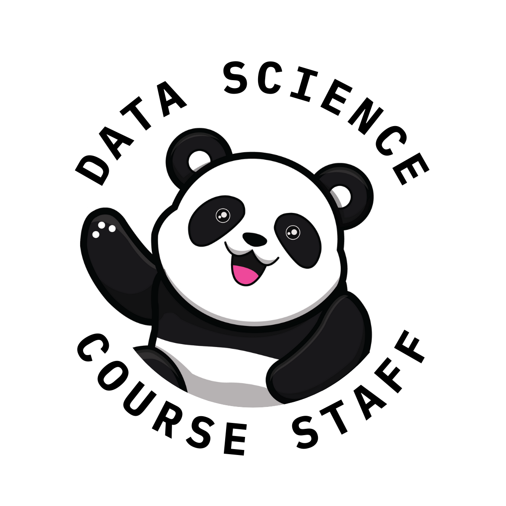

# {{ site.tagline }} 🧑‍🏫
{: .no_toc }
{: .mb-2 }
{{ site.description }}
{: .no_toc }
{: .fs-6 .fw-300 .mb-2 }

{: .mb-3 }
**Class**: Mondays, 10-10:50AM, Center Hall 201
{: .mb-0 .fs-5 .text-grey-dk-000 }

---

## Table of contents
{: .no_toc .text-delta }

1. TOC
{:toc}

---

## Schedule

_**Note**: This is Suraj's first time leading DSC 95, and this is a discussion-heavy course. As such, the schedule below is likely to change quite a bit throughout the quarter._

Homeworks can be found at the bottom of the corresponding week's webpage.

| Week | Class | Discussion Topic | Homework | Project |
| --- | --- | --- | --- | --- |
| 1 | Monday, April 3rd | [Introduction, Responsibilities, Imposter Syndrome](weeks/01) | Homework 1 (due Sunday, April 9th) | |
| 2 | Monday, April 10th | [Structural Factors, Growth vs. Fixed Mindset](weeks/02) | Homework 2 (due Sunday, April 23rd) | |
| 3 | Monday, April 17th | [Office Hours, Professionalism, Grading](weeks/03) | Homework 3 (due Sunday, April 23rd) |  |
| 4 | Monday, April 24th | Experienced Tutor Panel | | |
| 5 | Monday, May 1st | [Productivity Tips, Final Project Brainstorming, Grading](weeks/05) | Homework 4 (due Sunday, May 7th) | Instructions released |
| 6 | Monday, May 8th |  [Reflection](weeks/06) | Homework 5 (due Sunday, May 14th) | Checkpoint due Sunday, May 14th |
| 7 | Monday, May 15th | [Project Feedback](weeks/07) | |
| 8 | Monday, May 22nd | [Writing, Academic Integrity, Learning Theory](weeks/08) | | Second draft due Sunday, May 28th |
| 9 | Monday, May 29th | No Class (Memorial Day) | | Final Project due Sunday, June 4th at 12PM |
| 10 | Monday, June 5th | [Learning Theory, Conclusion](weeks/10) | | [CAPEs](https://cape.ucsd.edu) + [End-of-Quarter Survey](https://docs.google.com/forms/d/e/1FAIpQLScJcBYOsIvoRxHDqLCXolS1GmKvag-UVksNMSi8b_nh0oEZxA/viewform) due Saturday, June 10th at 8AM | 

---

## About

DSC 95 is a 2-unit, P/NP discussion-based course that is **required** of all first-time DSC tutors. The course is designed to guide new DSC tutors through their first quarter as a tutor. The specific topics we will cover are in the [Schedule](#schedule) above. 

Note that the class is **not** lecture based. We tell our students that the best way to learn concepts in data science is by **doing** data science, whether that's actually writing `pandas` code or practicing runtime analysis problems. Likewise, the best way to learn how to teach data science is to actually teach data science, which you will get practice with in office hours and on your class' discussion board. DSC 95 provides you with a forum to reflect on your teaching with a group of students who are also at the start of their teaching journeys.

> _There is exactly one goal in this class, and that is to get you to think very carefully about your teaching, to consider different scenarios that might arise (and how to deal with them), and to get you to genuinely enjoy teaching! (Okay, that was actually three goals, but they're basically the same thing in my mind.) - [Victor Huang, CS 375 @ Berkeley](https://cs375.github.io/su22/about.html)_

---

## People

{{ site.staffers }}

_Remember that [dsc-courses.github.io](https://dsc-courses.github.io) contains links to course websites of several DSC courses._

---

## Requirements

DSC 95 is graded P/NP. There are three things you need to do to pass:

1. **Attend and participate** in all DSC 95 class sessions (Mondays at 10AM in Center Hall 201).
    - This is a discussion-based class, so attendance **and participation** are mandatory. (How can you expect your students to be engaged if you're not? 😉)
    - In class, you will be expected to complete in-class worksheets; these are graded on the following scale:
        - 2: Thoughtful and complete
        - 1: Lack of effort
        - 0: Not submitted
    - If you need to miss a DSC 95 class session for any reason (e.g. if you're sick or have a conflicting exam), let Suraj know in advance on Slack.
        - Note that lecture attendance for the class you're tutoring for is _not_ a requirement of DSC 95; your instructor may still require you to attend as part of your paid tutor duties.
    - You can miss at most 4 participation points (i.e. 2 DSC 95 class sessions) and still pass.
1. **Complete weekly readings and homework assignments**, usually due on Sundays at 11:59PM.
    - Each week, we will provide you with readings and tasks to complete that should help you reflect on your time as a tutor so far. These will all be posted in the above [Schedule](#schedule).
    - Responses are graded on the same 2/1/0 scale that in-class worksheets are graded on.
    - Since the readings and homeworks are short (~1 hour per week), there are no slip days or extensions. We need your responses in no later than Sunday night so that we can plan the next day's class session. 
    - You can miss at most 1 weekly assignment and still pass.
1. **Complete a satisfactory Final Project**.
    - The Final Project in DSC 95 is an open-ended assignment where you'll produce some sort of educational material (e.g. a video, diagram, or website) that will benefit students in the course you're tutoring.
    - Not only will your Final Project be given to your class' instructor, but it'll also be part of the "DSC 95 Project Showcase" for future DSC 95 students to see!
    - More details to come.

<!-- ### Academic Integrity

In this course we expect students to adhere to the UC San Diego Integrity of Scholarship Policy. This means that you will complete your work honestly, with integrity, and support and environment of integrity within the class for which you are tutoring. Some examples of specific ways this policy applies to DSC 95 include:
Honesty about attendance (including punctuality, and illness) in class
Completion of pre-class assignments individually and on-time
Encouraging honest work among the students in the class for which you are tutoring
Reporting suspected instances of academic dishonesty in this class, as well as in the class you are tutoring, to the instructor right away. -->

---

## Useful Information

Here's an assortment of information that will be useful the first time you tutor.

### Payment
{: .no_toc }

To get paid for your tutoring hours, submit your hours biweekly into [Ecotime](https://ecotimecampus.ucsd.edu).

- Resources for using Ecotime can be found [here](https://blink.ucsd.edu/finance/payroll/timekeeping/ecotime/index.html); a quick guide (that is also linked on this site) can be found [here](https://blink.ucsd.edu/_files/payroll/ecotime/eco-qg-studenttimeentry.pdf).
- Instructions for setting up Direct Deposit can be found [here](https://ucpath.ucsd.edu/benefits-payroll/payroll/payment-methods.html). Note that you must set up your UC Path account to access the Direct Deposit page. Follow [this](https://ucpath.ucsd.edu/self-service/first-time-ucpath.html) guide for accessing UC Path for the first time. 
- The payroll calendar can be found [here](https://blink.ucsd.edu/finance/payroll/timekeeping/deadline.html); it describes when timesheets are due and when you'll be paid.

### Outside Tutoring
{: .no_toc }

As a tutor, you are not permitted to approach students to offer services of any kind in exchange for pay, including tutoring services. This is considered solicitation for business and is strictly prohibited by University policy.

On a related note, as a tutor, you should only help students in your course through official channels (e.g. office hours or Ed). You may be friends with some of your students and have them on social media, but they should **not** message you on social media with questions about the course. All students should have equal access to course staff – your friends shouldn't have an unfair advantage just because you happen to be a tutor. 

---

## Acknowledgements

DSC 95 was designed and run by Marina Langlois for many quarters, so much of what you see here was originally developed by her. When designing this quarter's offering of DSC 95, I also referred to CSE 95 taught by Mia Minnes and [CS 375](https://cs375.github.io/su22/) taught by Victor Huang at Berkeley.

---

Sweaters coming soon! 👀

